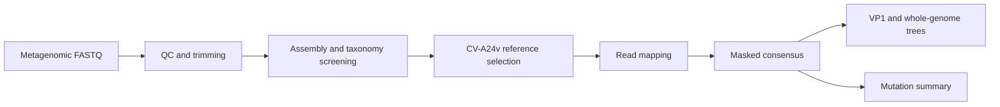

# Coxsackievirus A24 Variant Outbreak Genomics, Islamabad 2023

[](https://zenodo.org/badge/latestdoi/1065981765)
[](https://github.com/adnanhaider81/cva24v-ahc-2023-analysis/actions/workflows/smoke-test.yml)

Snakemake workflow for pathogen-discovery screening and targeted Coxsackievirus A24 variant (CV-A24v) analysis from metagenomic paired-end RNA sequencing libraries.

Published paper:

Haider SA, Jamal Z, Ammar M, Hakim R, Afrough B, Kreku A, Inamdar L, Salman M, Umair M. Genomic characterization of the Coxsackievirus A24 variant in the Acute Hemorrhagic Conjunctivitis outbreak 2023 in Islamabad, Pakistan through metagenomic next generation sequencing. Journal of Virological Methods. 2025. https://doi.org/10.1016/j.jviromet.2025.115213

Current software release: `2.0.3`

## Abbreviations

| Term | Meaning |
| --- | --- |
| CV-A24v | Coxsackievirus A24 variant |
| AHC | Acute hemorrhagic conjunctivitis |
| VP1 | Viral protein 1 |
| NGS | Next-generation sequencing |
| SPAdes | Genome assembler used for contig generation |
| BLAST | Basic Local Alignment Search Tool |
| BWA | Burrows-Wheeler Aligner for read mapping |
| MAFFT | Multiple-sequence alignment program |
| IQ-TREE | Maximum-likelihood phylogenetic tree program |
| QC | Quality control |

## Repository Contents

- `workflow/Snakefile`: main Snakemake workflow.
- `config/config.yaml`: run configuration. The default points to synthetic example reads.
- `analysis/scripts/`: helper scripts for contig QC, taxonomy summaries, reference selection, VP1 extraction, and mutation summaries.
- `data-example/`: synthetic FASTQ, contig, and count files for smoke tests.
- `env/environment.yml`: conda environment with command-line bioinformatics tools.
- `env/requirements.txt`: Python-only dependencies for lightweight checks.

No patient reads or restricted outbreak data are included.

## Workflow overview

This repository documents a metagenomic-to-targeted workflow for CV-A24v outbreak analysis: discovery screening, contig QC, reference selection, consensus generation, whole-genome and VP1 phylogeny, and amino-acid difference summaries. The default configuration uses synthetic inputs so the workflow structure can be reviewed without private outbreak data.



## Workflow Summary

1. Run read QC with FastQC and paired-end trimming with Trimmomatic.
2. Assemble trimmed reads with SPAdes.
3. Summarize contigs and, when configured, classify reads and contigs with Kraken2 and Kaiju.
4. Check contigs with BLASTN and select a CV-A24v reference, falling back to `D90457.1`.
5. Map reads with BWA, call variants with bcftools, and write masked consensus FASTA files.
6. Build whole-genome and VP1 alignments with MAFFT.
7. Infer phylogenies with IQ-TREE.
8. Summarize amino acid differences against the prototype and Pakistan 2005 comparator accessions.

## Quick Checks

These checks use only the bundled synthetic files and are suitable after cloning the repository.

```bash
python3 -m pip install -r env/requirements.txt
python3 -m pip install snakemake==7.32.4 pulp==2.7.0
make smoke
make dry
```

`make smoke` validates the synthetic inputs, compiles the Python scripts, runs contig QC, and regenerates the example plot. `make dry` builds the Snakemake DAG without running the full analysis.

## Full Run

The full workflow expects the external command-line tools listed in `env/environment.yml`.

```bash
conda env create -f env/environment.yml
conda activate cva24v-env
export NCBI_EMAIL="you@example.com"
make run THREADS=4
```

An NCBI API key is optional but recommended for repeated E-utilities requests:

```bash
export NCBI_API_KEY="your_ncbi_api_key"
```

## Configuration

Edit `config/config.yaml` before running private or newly generated data. Keep private reads outside the repository, for example under `data-private/`.

```yaml
pairs:
  - sample: CVA24V_DEMO_01
    r1: data-example/fastq/CVA24V_DEMO_01_R1.fastq
    r2: data-example/fastq/CVA24V_DEMO_01_R2.fastq

discovery:
  min_len_contig: 300
  blast_remote: true

reference:
  fallback_acc: D90457.1

phylogeny:
  wg_model: GTR+G+I
  vp1_model: K2P+I
  bootstrap: 1000
  use_model_finder: false
  min_depth_consensus: 10

kraken2:
  enable: false
  db: /data/db/kraken2/k2_standard_202507

kaiju:
  enable: false
  db_fmi: /data/db/kaiju/kaiju_db_nr_euk.fmi
  nodes: /data/db/kaiju/nodes.dmp
  names: /data/db/kaiju/names.dmp
```

Kraken2 and Kaiju are disabled in the default synthetic configuration because their databases are large and must be supplied locally. Set `enable: true` and update the paths when those databases are available.

## Main Outputs

- `results/discovery/<sample>_taxonomy_summary.tsv`
- `results/discovery/<sample>_selected_targets.yaml`
- `results/consensus/<sample>.fa`
- `results/consensus/all_consensus.fasta`
- `results/aln/wg_alignment.fasta`
- `results/iqtree/wg.treefile`
- `results/vp1/vp1_alignment.fasta`
- `results/iqtree/vp1.treefile`
- `results/mutations/aa_changes.tsv`

## Data Policy

The tracked example data are synthetic and are intended only for testing repository setup. Do not commit patient reads, raw outbreak data, local database files, BAM/VCF outputs, or private metadata. The `.gitignore` file excludes common generated and private paths.

## Apptainer/Singularity container

HPC-friendly Apptainer/Singularity support is available at `containers/Apptainer.def`. Build it from the repository root:

```bash
apptainer build containers/cva24v-ahc-2023-analysis.sif containers/Apptainer.def
```

Use the image on systems where Apptainer or Singularity is preferred over Docker.

## Data governance

See [DATA_GOVERNANCE.md](DATA_GOVERNANCE.md) for public-data, restricted-data, and sample-identifier handling rules.

## Citation

- Paper: https://doi.org/10.1016/j.jviromet.2025.115213
- Software: Haider SA. Coxsackievirus A24 Variant Outbreak Genomics, Islamabad 2023. Version 2.0.3. Zenodo. https://doi.org/10.5281/zenodo.20257884
- All-version software DOI: https://doi.org/10.5281/zenodo.20257436

## Key References

- Andrews S. FastQC. Babraham Bioinformatics.
- Bolger AM, Lohse M, Usadel B. 2014. Trimmomatic. Bioinformatics 30:2114-2120.
- Bankevich A, Nurk S, Antipov D, et al. 2012. SPAdes. J Comput Biol 19:455-477.
- Camacho C, et al. 2009. BLAST+. BMC Bioinformatics 10:421.
- Li H. 2013. BWA-MEM. arXiv:1303.3997.
- Li H, et al. 2009. SAMtools. Bioinformatics 25:2078-2079.
- Danecek P, et al. 2021. BCFtools. GigaScience 10:giab008.
- Katoh K, Standley DM. 2013. MAFFT. Mol Biol Evol 30:772-780.
- Minh BQ, et al. 2020. IQ-TREE 2. Mol Biol Evol 37:1530-1534.
- Koster J, Rahmann S. 2012. Snakemake. Bioinformatics 28:2520-2522.
- Wood DE, Lu J, Langmead B. 2019. Kraken 2. Genome Biology 20:257.
- Menzel P, Ng KL, Krogh A. 2016. Kaiju. Nat Commun 7:11257.
